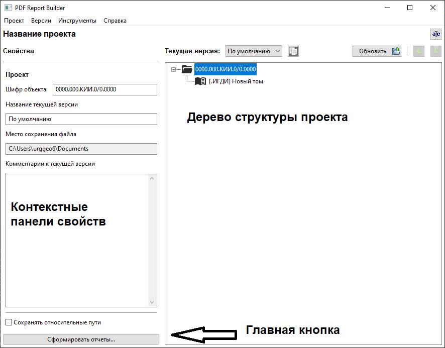

# PDF Report Builder

Программа, предназначенная для формирования структуры техотчетов по ИГДИ и последующей компоновки итоговых PDF-документов из исходных

## Обзор
Пользователь формирует структуру техотчета, сохраняет её на диск, как отдельный проект, и формирует выходные PDF-тома на основе структуры через кнопку ``Сформировать отчеты...``

Один проект соответствует одному файлу на диске с расширением `.reportprj`. Внутри одного проекта есть несколько [версий](Проект и версии.md). В один момент активна только одна версия, структуру которой показывает дерево структуры проекта. Между версиями можно переключаться с помощью выпадающего списка вверху основного окна программы.

Структура проекта состоит из:

- **Корневого узла**: отвечает за настройки проекта и текущей версии

- **[Томов](Тома.md)**: один техотчет может состоять из одного тома или нескольких. Каждому тому соответствует один итоговый PDF-документ, который будет собираться из исходных PDF-документов, входящих в его состав

- **[Структурных элементов](Структурные элементы.html)**: логические составные части тома, например, Содержание тома, или Картограмма топографо-геодезической изученности. Структурные элементы могут быть вложены друг в друга, например, элемент Графическая часть может содержать элементы-схемки и элемент-топоплан, таким образом формируя древовидную структуру тома.
На уровне структурных элементов задаются настройки закладок и нумерации, как сквозной, так и в рамках одного элемента.
    
    - Кроме того, структурные элементы могут быть **[автособираемыми](Структурные элементы.html#_4)**. Пока доступен только один такой элемент - Содержание тома, который автоматически собирается по требованию на основе структуры тома, в который он добавлен, по шаблону в формате `.docx`.

- **Файлов**: PDF-файлы привязываются к отдельным структурным элементам. Нельзя добавить исходный файл к тому, не добавив структурного элемента. Можно добавить не весь файл целиком, а только отдельный набор страниц.

Составные части структуры можно добавлять и удалять - через контекстное меню в Дереве структуры, перетаскивать (туда, где это возможно с сохранением логичности структуры), копировать-вставлять, менять очередность.

При щелчке на отдельные составные части дерева слева меняются панели со свойствами для выбранного элемента.

Кнопка `Обновить` подтягивает с диска актуальную информацию обо всех исходных файлах - например, чтобы проверить, не потерялись ли они, не изменилось ли в них количество страниц. Рекомендуется ей пользоваться каждый раз, когда меняются исходные PDF-файлы.
