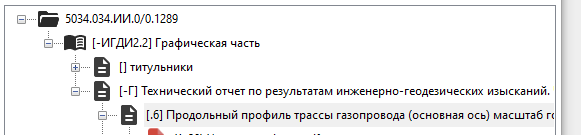
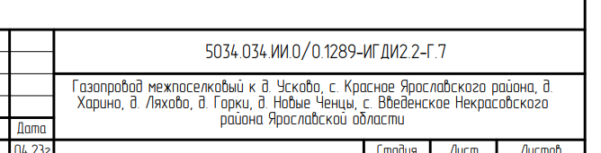

# Структурные элементы
Структурный элемент - логическая единица организации структуры внутри одного тома, которая может состоять из одного или нескольких PDF-документов. Например, топоплан, который разбит на несколько файлов, или Состав отчетной технической документации, который хранится внутри того же файла, что и текстовая часть.

Структурные элементы могут быть вложенными друг в друга. Настройки одного структурного элемента не распространяются на вложенные в него. При сборке PDF-файла тома в него сначала добавляется содержимое вложенных элементов, и только потом PDF-файлы, привязанные к данному структурному элементу.

## Настройки структурных элементов
**Название** - будет добавлено в конечный PDF тома как имя закладки. Также добавляется в автособираемый элемент "Содержание тома"

**Шифр** - Часть шифра, относящаяся к данному элементу. Шифры собираются по цепочке с корневого узла структуры вплоть до текущего элемента с учетом вложенности. В частности, у такого элемента:

полный шифр будет `5034.034.ИИ.0/0.1289-ИГДИ2.2-Г.6`

**Добавлять полный шифр в готовый документ** - если да, то полный шифр будет отрисовываться в рамке формы 3 по ГОСТ Р 21.101-2020

**Создавать закладку** - добавлять в PDF-документ тома закладку, отсылающую на первую страницу внутри этого элемента с учетом вложенности.

### Настройки нумерации
Нумерация бывает сквозная (в правом верхнем углу листа) и внутри элемента (в полях рамки Лист и Листов).

**Нумеровать листы внутри документа** - добавлять при сборке 2 числа (Лист и Листов).

**Включать в сквозную нумерацию** - если нет, то всё содержимое внутри структурного элемента не будет учитываться в сквозной нумерации проекта.

**Добавлять сквозную нумерацию в отчет** - некоторые элементы, например, Титульный лист, могут учитываться в сквозной нумерации, но само число в правом верхнем углу может не рисоваться. Поэтому действие по отрисовке значения включается и выключается отдельно

## Автособираемые структурные элементы
В структуре проекта они выделяются голубой иконкой: . Внутри таких элементов по требованию генерируются PDF-файлы на основании каких-то заданных характеристик. Заполнение их содержимым происходит автоматически, но только когда это инициирует сам пользователь. Запустить процесс сборки можно: а) тыкнув в контекстном меню на автособираемый элемент -> Сформировать PDF; б) в меню Инструменты -> Сформировать PDF для всех автособираемых. 

Путь для сохранения временного PDF можно задать на панели свойств автособираемого элемента (Врем. PDF...) **Внимание: при изменении этого пути существующие PDF-файлы по старому пути безвозвратно удаляются!**

Пока доступен только один такой элемент - содержание тома.

### Содержание тома
Формирует PDF с содержанием тома согласно Форме 13 (Приложение Т) ГОСТ Р 21.101-2020. Для корректной сборки содержания нужен правильный шаблон в формате .doc или .docx - несколько дефолтных приведены в папке `<Путь установки программы>\pdf_report_builder\data\computed_elements_templates`. Рекомендуется использовать или редактировать их, чтобы не было проблем с колонтитулами.

Сборка содержания тома работает внутри того тома, куда добавлен данный структурный элемент. В таблицу по Форме 13 приложение добавляет все структурные элементы, для которых отмечено *Создавать закладку*, и проставляет им сквозную нумерацию согласно текущей структуре проекта.

#### Баги и ограничения
- Если само содержание занимает несколько страниц в сквозной нумерации, его надо формировать 2 раза, так как каждый раз сквозная нумерация проставляется согласно текущей структуре проекта, а в первый раз это содержание ещё не занимает ни одной страницы в структуре
- Шифр проекта пока лучше забивать руками в шаблоне формата .docx, потому что просто так программно изменять содержимое колонтитулов не представляется возможным
- В процессе автосбора Word-документ шаблона должен быть закрыт, иначе будет ошибка